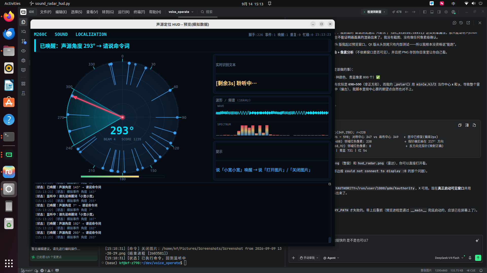

# m260c-voice-assistant

**用语音操作电脑与机械臂** —— 基于 WHEELTEC M260C 智能音箱（讯飞 XFM-DP 环形六麦阵列 + M2 系列降噪板），
在 Linux 上打通「唤醒 → 录音 → 离线识别 → 执行命令 / 大模型问答 → 语音播报」的完整闭环。

说「你好宽宽，打开图片」就打开图片；说「给我倒杯咖啡」就拉起机械臂推理脚本；其余任何话都交给 DeepSeek 回答并念出来。

English: [README.en.md](README.en.md)



*实时 HUD：环形声源雷达（左）+ 频谱瀑布图（中）+ 状态/日志/诊断面板（右）*

---

## 功能特性

| 能力 | 说明 |
|---|---|
| **板内唤醒 + 声源定位** | 唤醒词跑在音箱固件里（当前「你好宽宽」），唤醒事件与 0~360° 声源角度经串口上报，PC 侧零延迟响应 |
| **常开录音 + 环形预滚** | 进程启动即持续录音、维护最近 1.2s 环形缓冲，唤醒瞬间回溯预滚音频，**解决命令第一个字被切掉**的老问题 |
| **离线语音识别** | 默认 SenseVoice-Small（FunASR + ModelScope，CPU 推理），可 `--asr vosk` 回退到轻量 Vosk；配合滚动重解码给出近似实时的字幕 |
| **命令词执行** | 「打开图片」「关闭图片」「给我倒杯咖啡」（后台拉起机械臂推理脚本，可说「停止」中断） |
| **大模型兜底** | 命令词没匹配上的话交给 DeepSeek 问答，回复经 TTS 播报；未配 key 时自动进入桩模式，链路照样能跑通 |
| **语音播报** | edge-tts → ffmpeg → paplay 三级链路，按「文本 + 音色」哈希缓存，离线也能播；合成带超时重试 |
| **实时 HUD 界面** | PySide6/Qt6 绘制的科幻风界面：声源雷达、频谱瀑布图、电平条、状态与诊断面板，纯展示不参与控制（关掉界面程序照常跑） |
| **协议零依赖实现** | `mic_serial.py` 用标准库 `termios` 手写 0xA5 帧协议（握手/版本/手动唤醒/改唤醒词），无需讯飞账号 |

---

## 系统架构

```
┌──────────────────────────────────────────────────────────┐
│ M260C 智能音箱（板内唤醒引擎，「你好宽宽」跑在固件里）           │
└───────────────────────────┬──────────────────────────────┘
                            │ USB 串口 /dev/ttyACM2 (CH9102, 115200)
                            │ 0xA5 帧：握手 0x01 / 设备事件 0x04
                            ▼
              ┌─────────────────────────────┐
              │ serial_reader 线程            │ 持续 ACK 握手 + 解析事件
              │  - 节流回 0xFF 确认（1s/次）    │ 掉线自动重连
              │  - 提取唤醒 + 声源角度/波束/得分 │ 30s 一次诊断汇总
              └──────────────┬──────────────┘
                             │ _wake_q.put((angle, beam, score))
                             ▼
┌──────────────────────────────────────────────────────────┐
│ run_live 主循环（业务线程）                                   │
│  _wake_q.get() → _busy.set()                              │
│      ↓                                                    │
│  stream_recognize()                                       │
│      ├─ AudioCapture.grab_stream(3s)  先吐 1.2s 预滚再接实时  │
│      ├─ 落盘 audio/cmd_YYYYmmdd_HHMMSS.wav                 │
│      ├─ SenseVoice 滚动重解码线程（每 0.5s 重解 → 实时文本）    │
│      └─ 结束后用完整音频定稿                                 │
│      ↓                                                    │
│  dispatch(text)                                           │
│      ├─ 命中命令词 → 执行动作（图片 / 咖啡任务）               │
│      └─ 未命中 → DeepSeek 问答 + TTS 播报 → 失败则播兜底语     │
└──────────────────────────────────────────────────────────┘
                    ┌────────────────────────────────────┐
                    │ AudioCapture 采集线程（常开，独立）    │
                    │  arecord → 4000B 块 → 环形缓冲        │
                    │  on_chunk 回调 → HUD 波形/瀑布图       │
                    └────────────────────────────────────┘
```

> 关键设计：**控制通道（串口）与音频通道（USB 声卡）是两条独立链路**。唤醒与声源定位在降噪板内完成，PC 只负责录音、识别、决策、播报；串口读取独立线程持续握手，录音那几秒不再是盲区。

---

## 硬件要求

- **WHEELTEC M260C 智能音箱**：讯飞 XFM-DP 环形六麦克风阵列 + M2 系列降噪板 + 板载 USB 声卡
- 串口芯片 CH9102（`1a86:55d4`）→ `/dev/ttyACM*`（代码按 USB 芯片 ID 自动识别，不写死端口号）
- 录音：XFM-DP（USB Audio In，16000Hz 单声道）；播放：C-Media USB 声卡（48000Hz 立体声）
- 机械臂任务（可选）：lerobot + ACT 模型工作区，见下文「咖啡任务」

```bash
$ ls -l /dev/ttyACM*
crw-rw---- 1 root dialout 166, 2 /dev/ttyACM2     # 降噪板（本项目使用）
$ pactl list short sources | grep iflytek
… alsa_input.usb-iflytek_XFM-DP-V0.0.18_..._mono-fallback  s16le 1ch 16000Hz
```

## 环境依赖

**系统**：Python 3.12、`ffmpeg`、`paplay`（PulseAudio）、`arecord`/`aplay`（ALSA）、Linux 桌面环境（HUD 需 X11/Wayland）

**Python 包**

```bash
pip install funasr modelscope edge-tts PySide6 requests
```

| 包 | 用途 |
|---|---|
| `funasr` + `modelscope` | SenseVoice-Small 离线识别（首次运行自动下载约 936MB 到 `~/.cache/modelscope`） |
| `edge-tts` | 在线中文语音合成（合成结果会缓存，之后离线可播） |
| `PySide6` | HUD 界面 |
| `requests` | DeepSeek HTTP API |
| `vosk`（可选） | 轻量识别回退，需自备 `models/vosk-model-small-cn-0.22` |

---

## 快速开始

```bash
git clone https://github.com/jt-z/m260c-voice-assistant.git
cd m260c-voice-assistant

# 大模型兜底（可选，不配则进入桩模式）
export DEEPSEEK_API_KEY=sk-xxxxxxxx      # 或写入当前目录 .deepseek_key 文件

# 启动（带 HUD）
python voice_command_demo.py --ui --log-file run.log

# 不带界面
python voice_command_demo.py
```

**使用流程：先说唤醒词「你好宽宽」，听到回应后再说命令。**

| 你说 | 效果 |
|---|---|
| 你好宽宽 → 打开图片 | 打开桌面（回退到图片文件夹）里最新的图片 |
| 你好宽宽 → 关闭图片 | 关闭刚才打开的那张图 |
| 你好宽宽 → 给我倒杯咖啡 | 新开终端窗口跑机械臂推理脚本；执行中说「停止」可中断 |
| 你好宽宽 → 其它任何话 | 交给 DeepSeek 回答并语音播报 |
| （识别失败 / 无 key） | 播报兜底语「暂时还处理不了」 |

### 常用命令

```bash
# —— 主程序 ——
python voice_command_demo.py --ui                 # 带 HUD 界面
python voice_command_demo.py --asr vosk           # 回退 Vosk 识别
python voice_command_demo.py --no-llm             # 关闭大模型兜底
python voice_command_demo.py --duration 5         # 唤醒后录音 5 秒（默认 3）
python voice_command_demo.py --wav a.wav          # 直接识别已有录音（不连硬件）
python voice_command_demo.py --coffee-script /path/x.sh   # 换咖啡任务脚本

# —— 硬件与协议（无需讯飞账号）——
python voice_interact_test.py                     # 唤醒→录音→回放 循环测试
python voice_interact_test.py --version           # 查询降噪板固件版本
python voice_interact_test.py --manual-wake       # 手动触发唤醒（不用喊）
python voice_interact_test.py --set-wakeword "ni2 hao3 kuan1 kuan1"   # 改唤醒词（改完需拔插音箱）
python voice_interact_test.py --threshold 900     # 唤醒阈值，越大越难唤醒

# —— 识别基准 / 界面预览 / 单模块自测 ——
python bench_asr.py                               # Vosk vs SenseVoice 对比
python sound_radar_hud.py 30                      # 只预览 HUD（模拟数据，不连硬件）
python tts.py "测试一句话"
python llm.py "你好"
```

---

## 模块一览

| 文件 | 职责 | 依赖 |
|---|---|---|
| `voice_command_demo.py` | **主程序**：串起下面所有模块（唤醒→识别→执行/问答→播报） | 全部 |
| `mic_serial.py` | 讯飞 XFM-DP 串口协议实现（0xA5 帧 / 握手 / 事件解析 / 下发命令） | 纯标准库 `termios` |
| `audio_capture.py` | 常开录音 + 1.2s 环形预滚缓冲 | 标准库 + `arecord` |
| `asr_sensevoice.py` | SenseVoice-Small 离线识别封装（PCM / WAV 两种输入） | `funasr` + ModelScope |
| `tts.py` | edge-tts → ffmpeg → paplay，带哈希缓存、超时与重试 | `edge-tts` + `ffmpeg` + `paplay` |
| `llm.py` | DeepSeek 问答（OpenAI 兼容 HTTP API），未配 key 走桩模式 | `requests` |
| `sound_radar_hud.py` | PySide6 HUD：声源雷达 + 频谱瀑布图 + 状态/日志/统计 | `PySide6` |
| `voice_interact_test.py` | 硬件测试工具（固件版本、改唤醒词、音频路由、录音回放） | 标准库 |
| `bench_asr.py` | Vosk vs SenseVoice 识别基准对比 | 两者 |

---

## 文档

`notes/` 下是完整的中文技术文档，建议从 [notes/README.md](notes/README.md) 进入：

| 文档 | 内容 |
|---|---|
| [01-架构与线程模型.md](notes/01-架构与线程模型.md) | 整体链路、模块职责、线程与队列设计、共享状态同步 |
| [02-硬件与串口协议.md](notes/02-硬件与串口协议.md) | M260C/XFM-DP 硬件、0xA5 帧格式、消息类型、下发命令 |
| [03-音频采集与TTS.md](notes/03-音频采集与TTS.md) | 常开录音 + 环形预滚、播放路由、TTS 三级链路与缓存 |
| [04-语音识别.md](notes/04-语音识别.md) | Vosk vs SenseVoice、滚动重解码、首字丢失问题 |
| [05-命令与咖啡任务.md](notes/05-命令与咖啡任务.md) | 命令词表、图片功能、咖啡任务与脚本按键 |
| [06-大模型问答.md](notes/06-大模型问答.md) | DeepSeek 接入、推理模型 token 的坑、配置项 |
| [07-HUD界面.md](notes/07-HUD界面.md) | PySide6 实时界面：声源雷达 + 频谱瀑布图 |
| [08-踩坑与排错.md](notes/08-踩坑与排错.md) | **所有踩过的坑与修法 + 按症状查的排错手册** |

---

## 仓库内容说明

仓库只包含**源码与文档**，以下内容不在版本管理中（见 [.gitignore](.gitignore)），clone 后需自行准备：

| 未入库内容 | 原因 / 获取方式 |
|---|---|
| `语音模块客户资料V6.0_20260617/` | 厂商（WHEELTEC / 讯飞）提供的客户资料与 SDK，**版权归厂商，不便公开分发**；协议实现详见 `mic_serial.py` 与 notes 文档 |
| `models/` | Vosk 模型体积大；需自行下载 `vosk-model-small-cn-0.22` 放到该目录 |
| `audio/` | 实测录音存档（含人声）与 TTS 缓存，属于本机运行产物 |
| `.deepseek_key` | API 密钥，**请勿提交**；建议用环境变量 `DEEPSEEK_API_KEY` |

---

## 已知限制与注意事项

- **唤醒词在音箱固件里**，改唤醒词走串口命令（`voice_interact_test.py --set-wakeword "..."`），**改完需拔插音箱**才生效。
- 目标板内唤醒词出厂为「小微小微」，本仓库当前配置为「你好宽宽」，用前请与设备实际值对齐（见 `voice_command_demo.py: WAKE_WORD_TEXT`）。
- **咖啡任务依赖外部工作区**：默认脚本路径 `COFFEE_SCRIPT = /home/kf/LX/pai0/run_inference_b601_make_coffee_ACT_50k.sh` 及 lerobot/ACT 权重需自行准备，用 `--coffee-script` 可替换。
- **不含讯飞离线命令词 / 在线 AIUI 识别**（那需要讯飞开放平台 APPID 与资源文件）；本项目用本地 ASR 替代，因此无需讯飞账号即可跑通。
- HUD 需要图形环境（`DISPLAY`/Wayland）；无界面环境请去掉 `--ui`。Qt6 若报缺 `libxcb-cursor.so.0`，安装对应系统包即可。
- 首次运行会下载 SenseVoice 权重（约 936MB），加载约 5~6s；之后每条识别 0.1~0.25s。

---

## License

本项目基于 [MIT License](LICENSE) 开源。

第三方组件（FunASR / ModelScope / SenseVoice 模型、edge-tts、PySide6、Vosk 及其模型）版权归各自作者所有，遵循各自许可证；
`语音模块客户资料V6.0_20260617/` 中的厂商资料不包含在本仓库内，也不适用本项目的 MIT 许可。
